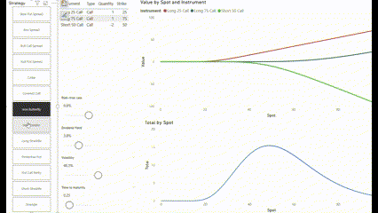

# Financial Toolkit in PowerBI

This is a experimental repository

## Project 1: Time Series Analysis

## Project 2: Option Strategies

This report shows the values of individual securities as well as the total payoff of the option strategy.

The theoretical values of the options are calculated using the Black-Scholes model.

# Appendix I: Notes on DAX

[The Definitive Guide to DAX – 2nd Edition](https://www.sqlbi.com/books/the-definitive-guide-to-dax-2nd-edition/companion/)

## Chapter 1: DAX

## Chapter 2: DAX

## Chapter 3: Basic Table Functions

## Chapter 4: Evaluation Context

## Chapter 5: CALCULATE and CALCULATETABLE

## Chapter 5: Variables
`VAR` is actually a constant

## Chapter 8: Time Intelligence

## Chapter 9: Calculation Groups

> [!WARNING]  
> The calculation group column slicer applies to all visuals on the page by default. Disable this default behaviour using Edit Interaction.