> [!TIP]
> What's new? [Hedge Fund](#project-9-hedge-fund), (6/2) [Futures](#project-8-future-contracts) (6/1), [Exchange Rates](#project-7-exchange-rates) (5/31), [SOFR Forward Curve](#project-5-yield-curve-and-option-adjusted-spread) (5/30)

# Financial Toolkit in PowerBI

This is an experimental repository created for learning and educational purposes.

## Project 1: Time Series Analysis

The [Time Series Analysis](Time%20Series%20Analysis.pbix) report contains two pages. The **Metrics** page displays key performance and risk metrics, with interactive slicers to select the fund, benchmark, risk-free rate, time horizon, market condition (up, down, or all), and confidence interval.

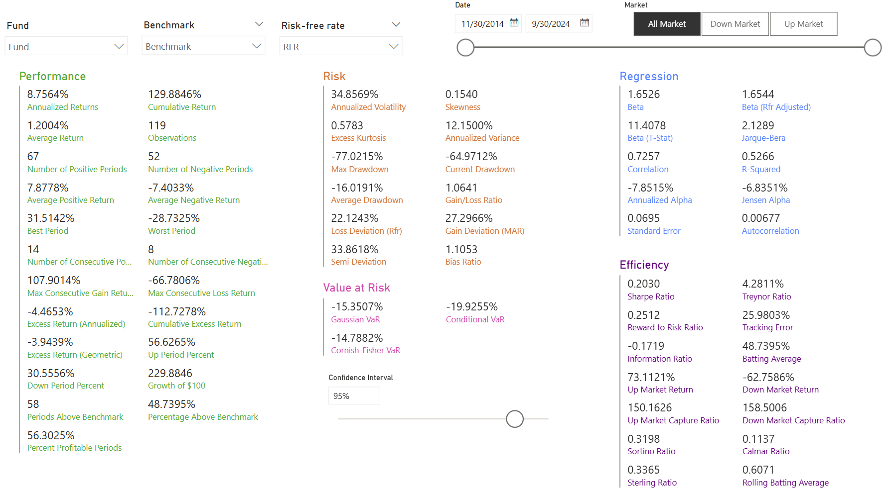

The **Charts** page visualizes the time series of a selected performance or risk metric, which can be displayed on a cumulative, rolling, trailing, or calendar-year basis.

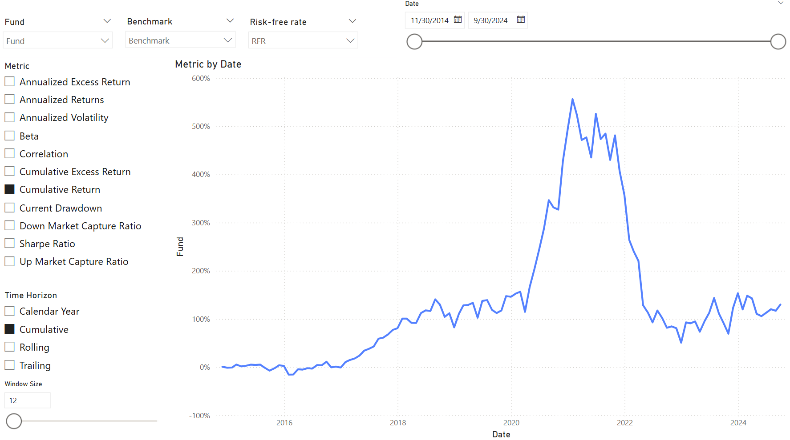

## Project 2: Option Strategies

The [Option Strategies](Option%20Strategies.pbix) report presents the values of individual securities and the total payoffs of various option strategies. Theoretical option values are calculated using the Black-Scholes model.

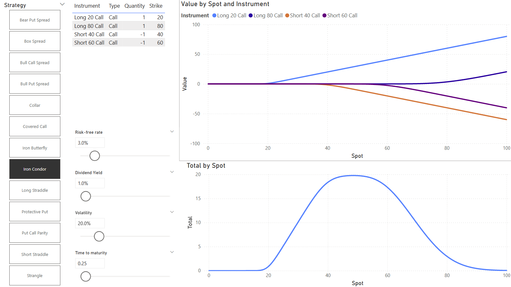

## Project 3: MSCI Real Time Index

The [MSCI Real Time Index](MSCI%20Real%20Time%20Index.pbix) report uses Power Query to retrieve real-time performance data from the [MSCI website](https://www.msci.com/real-time-index-data-search) and displays it in a bar chart. The data is delayed by 20 minutes. The base currency is predetermined and not user-configurable.

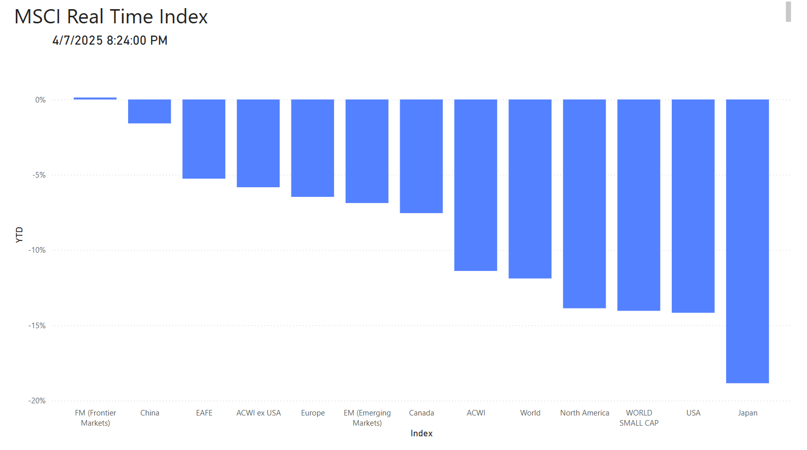

## Project 4: Stock Monitor

The [Stock Monitor](Stock%20Monitor.pbix) report uses Power Query to retrieve historical stock prices from Yahoo! Finance and displays them in a line chart. A slicer is included to normalize the starting stock price to $100, enabling a more meaningful comparison across different stocks.

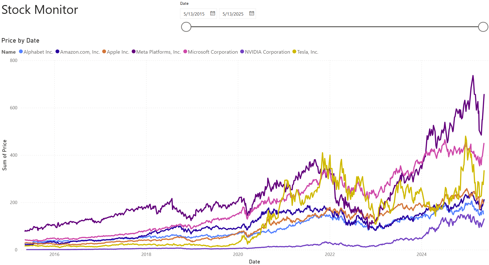

## Project 5: Yield Curve and Option-Adjusted Spread

The [Yield Curve](Yield%20Curve.pbix) report uses Power Query to retrieve historical par yield data from the US Treasury and presents changes in the yield curve using a line chart. An additional line chart illustrates the historical movement of yields across different maturities.

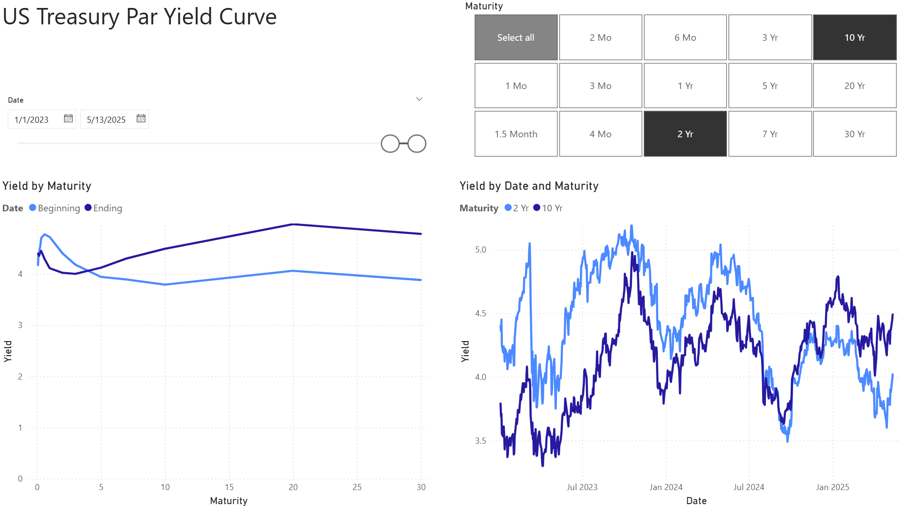

In the Forward Curve worksheet, Power Query retrieves the latest 1-month SOFR Average Index value, forward rates derived from SOFR futures, and the median interest rate projections published by the Federal Open Market Committee (FOMC).

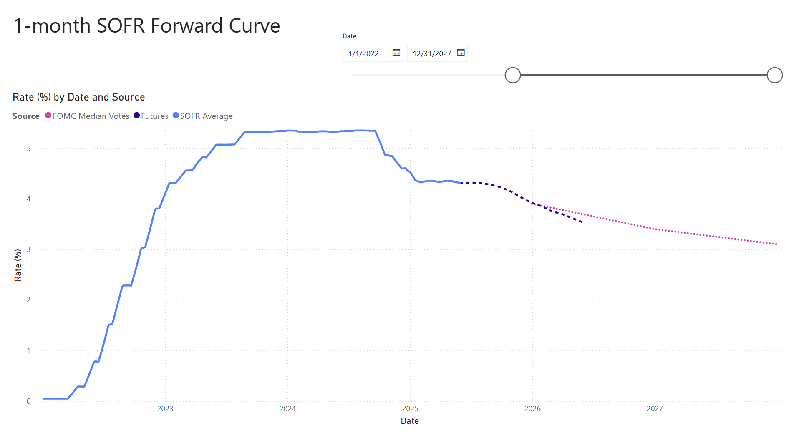

In the OAS worksheet, Power Query retrieves historical Option-Adjusted Spread (OAS) data from the Federal Reserve Economic Data (FRED) database and visualizes the selected OAS trends over time.

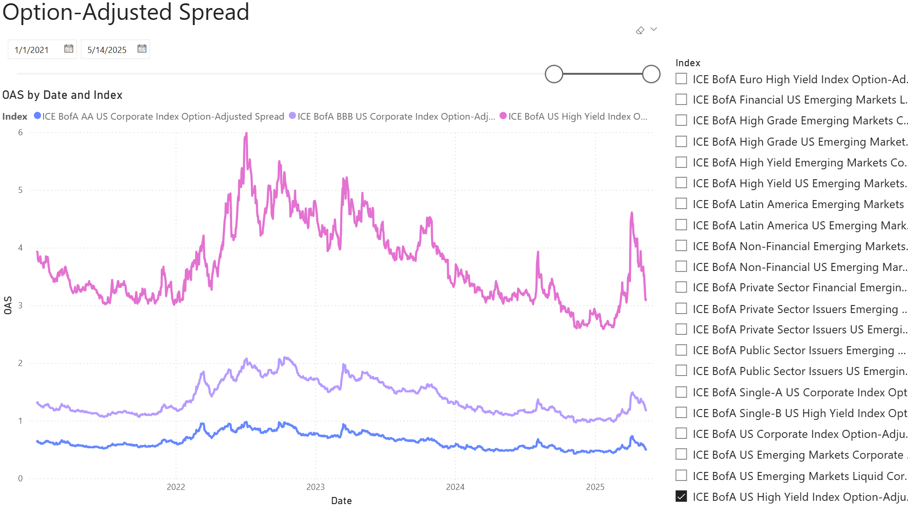

In the Policy Rate worksheet, Power Query retrieves historical central bank policy rates from the Bank for International Settlements (BIS) database and visualizes their trends over time for the selected countries.

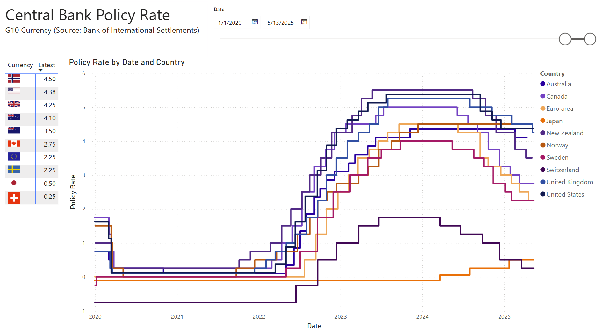

## Project 6: Purchasing Power Parity

The [Purchasing Power Parity](Purchasin%20Power%20Parity.pbix) report uses the Purchasing Power Parity (PPP) conversion factor from the World Bank and annual exchange rates from the Bank of Canada to calculate the extent to which a currency is overvalued or undervalued relative to its Purchasing Power Parity (PPP)-implied value against the Canadian dollar.

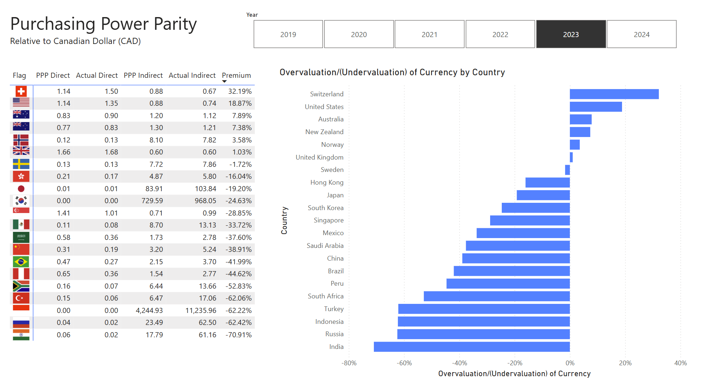

## Project 7: Exchange Rates

The [Forex](Forex.pbix) report uses the Bank of Canada's average daily exchange rates to calculate cross rates and percentage changes over time. Use the tabs to navigate between currencies by region (note: CAD and USD are always shown for reference). Hover over any cell to view the direct and indirect exchange rates, as well as their respective changes during the selected period.

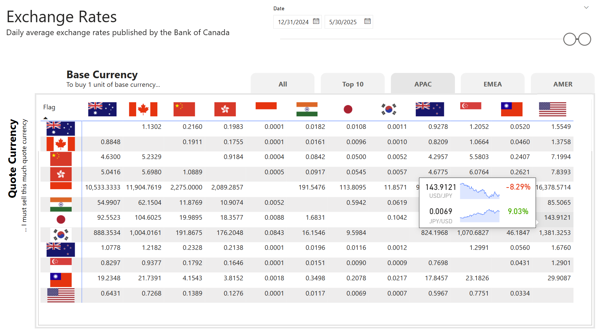

## Project 8: Future Contracts

The [Futures](Futures.pbix) report presents the top five futures by trading volume within each category.

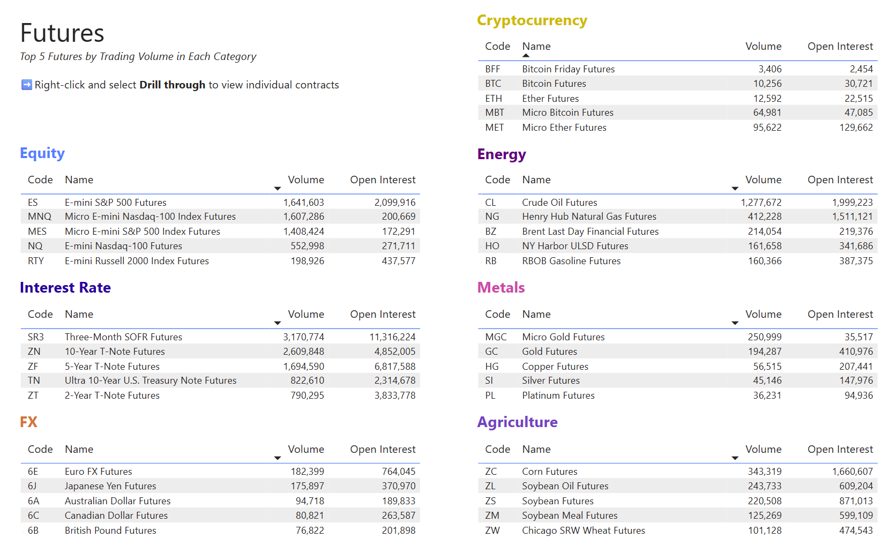

To access detailed data on individual contracts and their forward curves, right-click and select **Drill Through**.

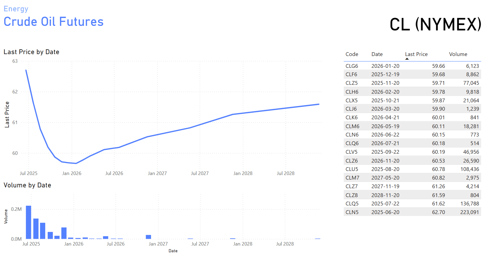

## Project 9: Hedge Fund

The [Hedge Fund](Hedge%20Fund.pbix) report analyzes the performance of hedge fund indices across different regions, investment strategies, and time horizons.

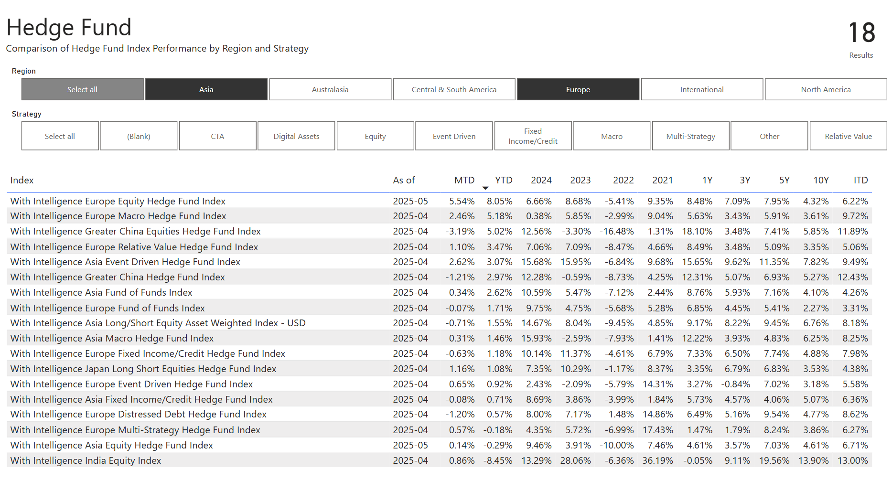

The second worksheet displays the flagship hedge fund indexes using a Value Added Monthly Index (VAMI) chart, shows the Compound Annual Growth Rate (CAGR) in a bar chart, and presents annual returns in a table. Users can **drill down** to view returns by quarter and month by clicking the double down ⬇️⬇️ button.

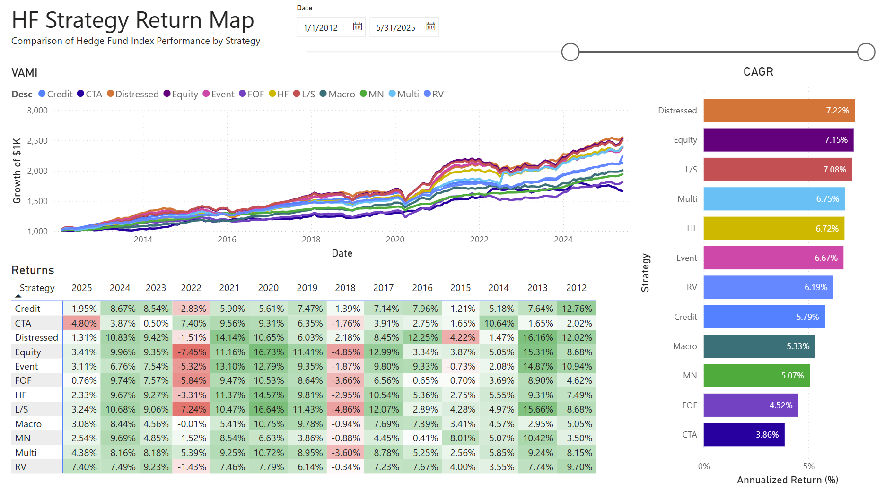