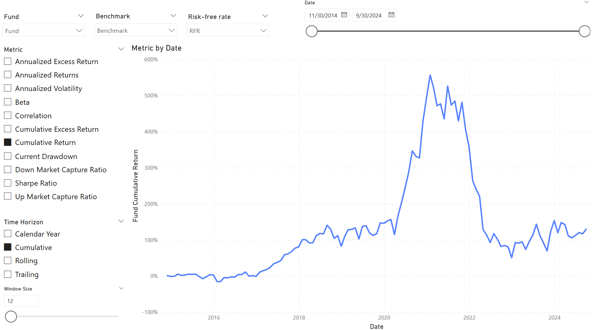

# Financial Toolkit in PowerBI

This is an experimental repository created for learning and educational purposes.

## Project 1: Time Series Analysis

The [Time Series Analysis](Time%20Series%20Analysis.pbix) report contains two pages. The **Metrics** page displays key performance and risk metrics, with interactive slicers to select the fund, benchmark, risk-free rate, time horizon, market condition (up, down, or all), and confidence interval.

The **Charts** page visualizes the time series of a selected performance or risk metric, which can be displayed on a cumulative, rolling, trailing, or calendar-year basis.

## Project 2: Option Strategies

The [Option Strategies](Option%20Strategies.pbix) report presents the values of individual securities and the total payoffs of various option strategies. Theoretical option values are calculated using the Black-Scholes model.

## Project 3: MSCI Real Time Index

The [MSCI Real Time Index](MSCI%20Real%20Time%20Index.pbix) report uses Power Query to retrieve real-time performance data from the [MSCI website](https://www.msci.com/real-time-index-data-search) and displays it in a bar chart. The data is delayed by 20 minutes. The base currency is predetermined and not user-configurable.

## Project 4: Stock Monitor

The [Stock Monitor](Stock%20Monitor.pbix) report uses Power Query to retrieve historical stock prices from Yahoo! Finance and displays them in a line chart. A slicer is included to normalize the starting stock price to $100, enabling a more meaningful comparison across different stocks.

# Appendix I: Notes on DAX

    
Under construction

[The Definitive Guide to DAX – 2nd Edition](https://www.sqlbi.com/books/the-definitive-guide-to-dax-2nd-edition/companion/)

## Chapter 1: DAX

## Chapter 2: DAX

## Chapter 3: Basic Table Functions

## Chapter 4: Evaluation Context

## Chapter 5: CALCULATE and CALCULATETABLE

## Chapter 6: Variables
`VAR` is actually a constant

## Chapter 8: Time Intelligence

## Chapter 9: Calculation Groups

> [!WARNING]  
> The calculation group column slicer applies to all visuals on the page by default. Disable this default behaviour using Edit Interaction.

